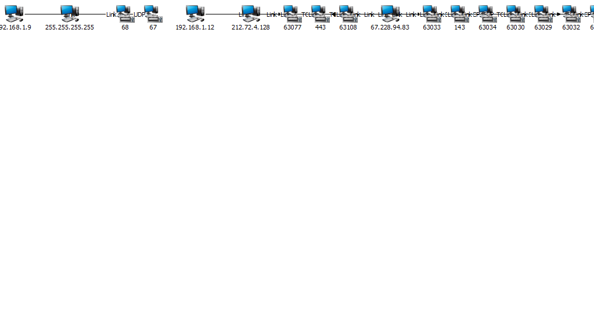
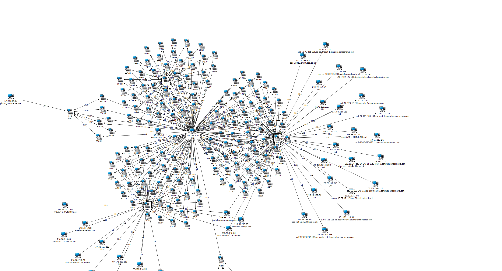

# Pcap 2 I2

I often need to get data into I2 for some quick analysis, and today I was able to spend a little time to format the data, to take the pain out of the I2 Analysis Phase.

I am trying to look at a data flow, which I2 will already do well.

But I want to enhance the process by
   - Indicate if it is TCP or UDP
   - enhace IP Addresses  by adding NodeNames 
   - add the Socket type i.e. 21 is FTP etc

# Prerequisits

You will need the following packages

  - python-scapy3
  - daiquiri
  
 When you have this installed you should be able to install the Package with a 
 
     pip install PCAP2I2
     
     
 # How to use this ?
 
 I wrote this so that I can quickly import PCAP data files into IBM's I2 product.
 
 So to start off with you need a PCAP file. 
 
     tcpdump -i en0 -w bbc.pcapng
 
 And then in a Web browser open [http://www.bbc.com](http://www.bbc.com)
 
 With your PCAP(ng) file, you just put the data files to be converted into the **./data** directory, and then you run the **main.py**.
 
 This will generate 3 output files per PCAP input file
 
     - packets.csv
     - hosts.csv
     - ports.csv
     
  These 3 files can be loaded into I2, and should assist in making a fairly quick and easy to ready IP Data Map.
  
 
 # Running
 
 I suggest you run it something like this
 
     ./main.py --myhosts myhosts.txt
     
 Where myhosts.txt looks like
 
 ```text
1.2.3.4 somemachine
4.3.2.1 another-machine
```

If you want to put the data in another directory then

```bash
   ./main.py -data "/myfolder/data/dir1/dir2/*.pcapng"
```

Note the escaped filespec (due to the wildcard)

To process just 1 file


```bash
   ./main.py -data /myfolder/data/dir1/dir2/onefile.pcapng
```

## I2 Side 

End to end walkthrough.

### Generate pcap
I am on a Mac so I have a slightly strange network interface 


    tcpdump -i en0 -w bbc.pcapng

You in another window type 

    curl http://www.bbc.co.uk
    
Switch back to the first window and press Control-C

We should have a file called bbc.pcapng sitting in the directory. If not - try again, do not pass Go etc.

Converting the data

    python main.py --data ./bbc.pcapng
    
I se the following output

```text
bbc_data $ ../main.py --data bbc.pcapng
WARNING: No route found for IPv6 destination :: (no default route?). This affects only IPv6
2018-03-20 13:44:54,060 [50295] INFO     root: bbc.pcapng
2018-03-20 13:44:54,061 [50295] INFO     <class 'PCAP2I2.PCAP2I2.PCAP2I2'>: Starting PCAP2I2.PCAP2I2
2018-03-20 13:44:54,061 [50295] INFO     <class 'PCAP2I2.PCAP2I2.PCAP2I2'>: Creating Pcap Reader
2018-03-20 13:44:55,606 [50295] INFO     <class 'PCAP2I2.PCAP2I2.PCAP2I2'>: in I2_OUT
2018-03-20 13:45:43,024 [50295] INFO     root: Packets Processed
2018-03-20 13:45:43,025 [50295] INFO     root: Hosts Processed
2018-03-20 13:45:43,026 [50295] INFO     root: Ports Processed
2018-03-20 13:45:43,027 [50295] INFO     root: Finished Processing
```

And I now have 3 csv files.

    bbc.pcapng.csv
    bbc.pcapng.hosts.csv
    bbc.pcapng.ports.csv

I open I2 and Import the first csv file. I have created a Custom Import Process (which I will not go into here), and the data will appear as. 

This looks like this



Which visually initially does not look very interesting.

I now import the **hosts**.csv (Again using a different Custom I2 Loader)
And finally the **ports**.csv (With yet another custom Loader).

Finally I perform a **Compact Chart** and I now see 

And I get this scary looking image. 





I hope this has shown how you can use and automate data loading for I2 Anayst Notebook, when using IP data. 

